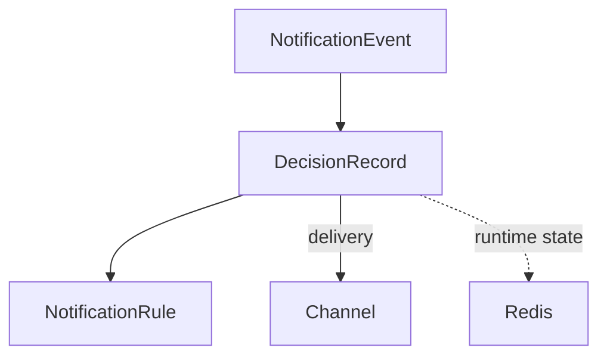

````
---
title: Data Model
---

# Data Model

This document describes the core entities used in the **Notification Prioritization Engine (NPE)**.

---

# 1️⃣ Entity Overview

```mermaid
graph TD

NotificationEvent -->|1:1| DecisionRecord
DecisionRecord -->|references (version snapshotted)| NotificationRule
DecisionRecord -. reads state .-> UserNotificationState[(UserNotificationState<br/>Redis - TTL keys)]
````

---

# 2️⃣ NotificationEvent

**Storage:**
Ephemeral in-memory object during pipeline execution.
Serialized into the `DecisionRecord` payload for audit storage.

**Purpose:**
Canonical normalized input to the engine.

---

## Fields

| Field           | Type    | Required | Constraints         | Notes                       |
| --------------- | ------- | -------- | ------------------- | --------------------------- |
| `event_id`      | UUID    | ✅        | Unique              | Idempotency key             |
| `user_id`       | String  | ✅        | Max 128 chars       | Target user identifier      |
| `event_type`    | Enum    | ✅        | See enum below      | Notification category       |
| `title`         | String  | ✅        | Max 120 chars       | Short notification title    |
| `message`       | String  | ❌        | Max 1000 chars      | Body text                   |
| `source`        | String  | ✅        | Max 64 chars        | Originating service         |
| `priority_hint` | Enum    | ❌        | See enum below      | Caller urgency hint         |
| `channels`      | Enum[]  | ✅        | Non-empty array     | Preferred delivery channels |
| `timestamp`     | ISO8601 | ✅        | UTC                 | Event creation time         |
| `expires_at`    | ISO8601 | ❌        | Must be > timestamp | Discard if expired          |
| `dedupe_key`    | String  | ❌        | Max 256 chars       | Optional dedup hint         |
| `metadata`      | JSONB   | ❌        | Max 4KB             | Arbitrary context           |

---

## Enums

### event_type

`MESSAGE`, `REMINDER`, `ALERT`, `PROMO`, `SYSTEM`, `UPDATE`, `SECURITY`, `DIGEST`

### priority_hint

`CRITICAL`, `HIGH`, `MEDIUM`, `LOW`

### channel

`push`, `email`, `sms`, `in_app`

---

# 3️⃣ DecisionRecord

**Storage:** PostgreSQL (Append-only)
**Partitioning:** Time-based (daily/weekly)
**Purpose:** Full audit trail for observability & support.

---

## Fields

| Field              | Type     | Notes                                                   |
| ------------------ | -------- | ------------------------------------------------------- |
| `decision_id`      | UUID     | Primary key                                             |
| `event_id`         | UUID     | Indexed for idempotency                                 |
| `user_id`          | String   | Indexed for per-user history                            |
| `outcome`          | Enum     | `NOW`, `LATER`, `NEVER`                                 |
| `reasons`          | String[] | Ordered reason codes                                    |
| `matched_rule_id`  | UUID     | FK → NotificationRule                                   |
| `score`            | Float    | Composite priority score                                |
| `defer_until`      | ISO8601  | Populated when outcome = LATER                          |
| `defer_count`      | Integer  | Max 2                                                   |
| `rule_version`     | String   | Snapshot of rule config                                 |
| `ai_used`          | Boolean  | Whether AI contributed                                  |
| `ai_score`         | Float    | AI raw score                                            |
| `decided_at`       | ISO8601  | Partition key                                           |
| `delivered_at`     | ISO8601  | Updated async                                           |
| `delivery_channel` | Enum     | Actual channel used                                     |
| `delivery_status`  | Enum     | `PENDING`, `DELIVERED`, `DELIVERY_FAILED`, `SUPPRESSED` |

---

## Indexes

* `(user_id, decided_at DESC)`
* `(event_id)` UNIQUE
* `(delivery_status)`

---

# 4️⃣ NotificationRule

**Storage:** PostgreSQL
**Caching:** In-memory cache on decision engine nodes
**Purpose:** Human-configurable routing logic

---

## Fields

| Field         | Type    | Notes                           |
| ------------- | ------- | ------------------------------- |
| `rule_id`     | UUID    | Primary key                     |
| `name`        | String  | Human-readable                  |
| `description` | String  | Optional                        |
| `priority`    | Integer | UNIQUE; lower = evaluated first |
| `conditions`  | JSONB   | Predicate tree                  |
| `action`      | JSONB   | Outcome block                   |
| `enabled`     | Boolean | Toggle rule                     |
| `version`     | String  | Semantic version                |
| `updated_by`  | String  | Operator identity               |
| `created_at`  | ISO8601 | Created timestamp               |
| `updated_at`  | ISO8601 | Last modified                   |

---

## Conditions Schema (JSONB)

```json
{
  "op": "AND",
  "rules": [
    { "field": "event_type", "operator": "eq", "value": "PROMO" },
    { "field": "priority_hint", "operator": "in", "value": ["LOW", null] }
  ]
}
```

Supported operators:
`eq`, `neq`, `in`, `not_in`, `gt`, `lt`, `gte`, `lte`, `exists`, `not_exists`

Logical combinators:
`AND`, `OR`, `NOT`

---

## Action Schema (JSONB)

```json
{
  "outcome": "LATER",
  "defer_strategy": "next_morning",
  "channel_override": null,
  "reason_code": "PROMO_DEFER_QUIET"
}
```

`defer_strategy` values:

* `fixed_delay_15m`
* `next_hour`
* `next_morning`
* `next_quiet_end`
* `digest_window`

---

# 5️⃣ UserNotificationState (Redis)

All keys are TTL-based.

| Key Pattern                     | Value Type   | TTL          | Purpose              |
| ------------------------------- | ------------ | ------------ | -------------------- |
| `npe:idem:{event_id}`           | String       | 24h          | Idempotency check    |
| `npe:count:{user_id}:5m`        | Sorted Set   | 5m           | Sliding counter      |
| `npe:count:{user_id}:1h`        | Sorted Set   | 1h           | Sliding counter      |
| `npe:count:{user_id}:24h`       | Sorted Set   | 24h          | Sliding counter      |
| `npe:dedup:hash:{sha256}`       | String       | 24h          | Exact dedup          |
| `npe:dedup:simhash:{fp}`        | String       | 24h          | Near dedup           |
| `npe:suppress:{user_id}:{type}` | String       | Cooldown     | Suppression          |
| `npe:defer:{event_id}`          | JSON         | Until expiry | Deferred payload     |
| `npe:defer_queue`               | Sorted Set   | Persistent   | Deferred schedule    |
| `npe:bloom`                     | Bloom Filter | Rotated      | O(1) dedup pre-check |

---

# 6️⃣ Bloom Filter Management

* Uses RedisBloom (`BF.ADD`, `BF.EXISTS`)
* Target false positive rate: **0.01%**
* Rotates at 70% capacity
* Old filter retained read-only for dedup window
* `BF.INFO` monitored; alert at 60%

---

# 7️⃣ Simplified Schema Flow



---

# 📌 Architectural Principles

* Idempotent event processing
* Immutable audit records
* Rule version snapshotting
* Redis for high-speed state
* PostgreSQL for durable storage
* Strict separation of input, decision, and rules

---

```

---
